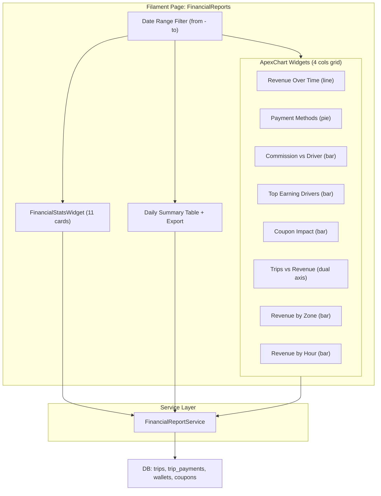

# Financial Reporting Page

## Architecture Overview

A new standalone Filament Page at `/admin/financial-reports` under the existing **"Finance"** navigation group (already used by `DriverWithdrawRequestResource`). The page will be composed of:

1. **Page class** with date range filter (from-to picker)
2. **Stats widget** (11 stat cards)
3. **8 ApexChart widgets** (using already-installed `leandrocfe/filament-apex-charts`)
4. **Daily summary table widget** with export (Excel + PDF)

A dedicated `**FinancialReportService`** will encapsulate all query logic (single responsibility), with Redis caching following the existing pattern in `[RevenueBreakdownWidget](app/Filament/Widgets/RevenueBreakdownWidget.php)`.

## Data Sources

All financial data will be queried from:

- `**trips**` table: `actual_fare`, `cancellation_fee`, `waiting_fee`, `ended_at`, `status`
- `**trip_payments**` table: `total_amount`, `final_amount`, `commission_amount`, `driver_earning`, `coupon_discount`, `additional_fees`, `status`
- `**wallets**` table (Bavix): `balance` for total wallet balances
- `**payment_methods**` table: for grouping by payment type
- `**zones**` table: for zone-based revenue breakdown
- Tax rate: fixed 15% (matching existing `[RevenueBreakdownWidget](app/Filament/Widgets/RevenueBreakdownWidget.php)` logic at line 74)
- Commission rate: from `GeneralSettings::commission_rate`

## Files to Create

### 1. Service: `app/Services/FinancialReportService.php`

Responsible for all financial queries. Methods:

- `getStatCards(array $dateRange)` -- returns aggregated stats (total revenue, company profit, driver earnings, avg trip fare, coupon losses, cancellation fees, waiting fees, pending payments, refunded amount, wallet balances, total taxes)
- `getRevenueOverTime(array $dateRange)` -- daily/weekly/monthly revenue grouped by date
- `getPaymentMethodsDistribution(array $dateRange)` -- count + amount per payment method
- `getCommissionVsDriverEarnings(array $dateRange)` -- monthly comparison
- `getTopEarningDrivers(array $dateRange, int $limit = 10)` -- top drivers by earnings
- `getCouponImpact(array $dateRange)` -- coupon usage count + total discount
- `getTripsVsRevenue(array $dateRange)` -- trip count vs revenue by period
- `getRevenueByZone(array $dateRange)` -- revenue grouped by zone
- `getRevenueByHour(array $dateRange)` -- revenue grouped by hour of day
- `getDailySummary(array $dateRange)` -- daily breakdown for the table

All methods will use efficient raw SQL or scoped Eloquent queries (following the pattern in `[AdvancedDashboardStatsWidget](app/Filament/Widgets/AdvancedDashboardStatsWidget.php)`). Redis caching with 300s TTL.

### 2. Page: `app/Filament/Pages/FinancialReports.php`

- Standalone Filament page (not a Resource)
- Navigation: group **"Finance"**, icon `heroicon-o-banknotes`, sort after withdraw requests
- Properties: `$dateFrom`, `$dateTo` (Livewire reactive)
- Header view with two date pickers (from/to) and "Apply" button
- Dispatches `financial-filter-changed` event to all child widgets
- Method `getHeaderWidgetsColumns()` returning responsive grid (2 cols on md, 4 cols on lg)
- Registers all widgets in order: stats -> charts -> daily table

### 3. Stats Widget: `app/Filament/Pages/FinancialReports/Widgets/FinancialStatsWidget.php`

Extends `StatsOverviewWidget`. 11 stat cards:

| Stat                  | Source                                           | Icon                              |
| --------------------- | ------------------------------------------------ | --------------------------------- |
| Total Revenue         | `SUM(trip_payments.final_amount)` where status=1 | `heroicon-m-currency-dollar`      |
| Company Profit        | `SUM(commission_amount)`                         | `heroicon-m-building-office`      |
| Total Driver Earnings | `SUM(driver_earning)`                            | `heroicon-m-truck`                |
| Average Trip Fare     | `AVG(final_amount)`                              | `heroicon-m-calculator`           |
| Total Taxes (15%)     | `total_revenue * 0.15`                           | `heroicon-m-receipt-percent`      |
| Coupon Discounts      | `SUM(coupon_discount)`                           | `heroicon-m-tag`                  |
| Cancellation Fees     | `SUM(trips.cancellation_fee)`                    | `heroicon-m-x-circle`             |
| Waiting Fees          | `SUM(trips.waiting_fee)`                         | `heroicon-m-clock`                |
| Pending Payments      | `COUNT + SUM` where status=0                     | `heroicon-m-exclamation-triangle` |
| Refunded Amount       | `SUM(final_amount)` where status=3               | `heroicon-m-arrow-uturn-left`     |
| Total Wallet Balances | `SUM(wallets.balance)`                           | `heroicon-m-wallet`               |

### 4. Chart Widgets (8 files in `app/Filament/Pages/FinancialReports/Widgets/`)

All extend `Leandrocfe\FilamentApexCharts\Widgets\ApexChartWidget`:

- `**RevenueOverTimeChart.php`** -- Line chart, daily revenue over selected period
- `**PaymentMethodsChart.php`** -- Pie/Donut chart, distribution by payment method
- `**CommissionVsDriverChart.php**` -- Stacked bar, commission vs driver earnings monthly
- `**TopEarningDriversChart.php**` -- Horizontal bar, top 10 drivers by earnings
- `**CouponImpactChart.php**` -- Bar chart, coupon count + discount amount by coupon
- `**TripsVsRevenueChart.php**` -- Dual-axis line chart, trips count vs revenue
- `**RevenueByZoneChart.php**` -- Bar chart, revenue per zone
- `**RevenueByHourChart.php**` -- Bar chart, revenue by hour of day (0-23)

### 5. Daily Summary Table: `app/Filament/Pages/FinancialReports/Widgets/DailySummaryTableWidget.php`

Extends `Filament\Widgets\TableWidget`. Columns:

- Date, Total Trips, Total Revenue, Commission, Driver Earnings, Coupon Discounts, Cancellation Fees, Waiting Fees, Net Revenue

### 6. Export Classes

- `**app/Exports/DailyFinancialSummaryExport.php**` -- Laravel Excel export (Maatwebsite/Excel)
- `**app/Exports/DailyFinancialSummaryPdf.php**` -- PDF generation (using barryvdh/laravel-dompdf or snappy)

Need to check if `maatwebsite/excel` and a PDF package are already installed. If not, we'll add them.

### 7. Header View: `resources/views/filament/pages/financial-reports-header.blade.php`

Date range picker UI with "from" and "to" inputs + Apply button (following the pattern in `[dashboard-header.blade.php](resources/views/filament/pages/dashboard-header.blade.php)`).

### 8. Translations

Add Arabic + English keys to `[lang/ar.json](lang/ar.json)` and create/update English translations for all labels.

### 9. Navigation Group Registration

Add **"Finance"** to the `navigationGroups` array in `[AdminPanelProvider.php](app/Providers/Filament/AdminPanelProvider.php)` (currently "Finance" is used by `DriverWithdrawRequestResource` but not registered in the panel provider groups list).

## Dependencies Check

- `leandrocfe/filament-apex-charts` -- already installed (^3.0)
- `maatwebsite/excel` -- need to verify / install for Excel export
- PDF package -- need to verify / install (barryvdh/laravel-dompdf)

## Key Design Decisions

- **Single service class** (`FinancialReportService`) for all financial queries -- keeps widgets thin, testable, and follows Clean Architecture
- **Redis caching** with date-range-based cache keys (same pattern as existing widgets)
- **Lazy loading** on all widgets (`$isLazy = true`) for fast initial page load
- **Raw SQL for aggregations** where performance matters (following existing pattern in `AdvancedDashboardStatsWidget`)
- **Currency**: SAR (Saudi Riyal) -- matching existing `->money('SAR')` usage
- **Tax**: 15% fixed (matching existing `RevenueBreakdownWidget` logic)

